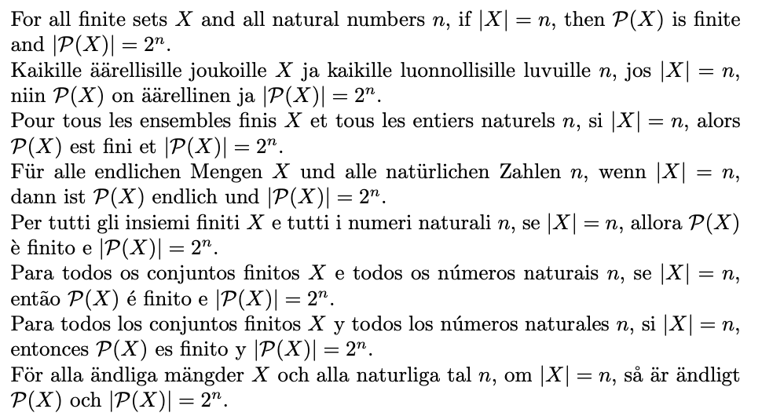

# gf-math: Informalization of Formal Mathematics

Mathematical terms, definitions, and propositions in as many languages
as possible with a translation to and from type-theory.

Most concepts are linked to
[Wikidata](https://www.wikidata.org/wiki/Wikidata:Main_Page)
identifiers and labels.

The main ideas are explained in [this YouTube talk](https://www.youtube.com/watch?v=UG6RUFS5esk) at the Hausdorff Institute in Bonn, 8 July 2024.
The slides of that talk are available [here](https://docs.google.com/presentation/d/1Nvmjn8D_7_tI_n6bM_HIoVlOXsPiOjWdtnhjWcqnkoo/edit?usp=sharing)

A more detailed introduction to a concrete task is [here](https://docs.google.com/presentation/d/10Z9zz020SnyrIM8gSUVURDCUe-j4gzTGkefTNRcZx1g/edit?usp=sharing);
a video is coming soon (Hausdorff Institute, 30 July 2024).

## An example from the 100 theorems

[ex100.pdf](./data/100_theorems/ex100.pdf).
For an explanation, see README in the same directory.

The following picture is a snapshot.




## Files

[conversion](./conversion): beginning of a conversion from Lean to grammars/v1

[data](./data): saved data from Wikidata and elswhere, with scripts for analysing it

[grammars](./grammars): GF grammars and code for analysing, generating, and embedding them

[lean-bnfc](./lean-bnfc): a BNF grammar for a part of Lean


## Version 1

This was the first "full-scale" version but implemented as a quick prototype.
Its code is in [grammars/v1](./grammars/v1)

The list of concepts and Wikidata links are from
[MathGloss](https://mathgloss.github.io/MathGloss/database).

The syntax in [grammars](./grammars) is adapted from
[this old GF code](https://github.com/GrammaticalFramework/gf-contrib/tree/master/cade-2011)
and follows the ideas of the paper
"Translating between language and logic: what is easy and what is
difficult" by A Ranta in CADE-2011
[Springer page](https://link.springer.com/chapter/10.1007/978-3-642-22438-6_3)
[free preprint](http://www.cse.chalmers.se/~aarne/articles/cade2011.pdf)

The work is also related to [GFLeanTransfer](https://github.com/pkshashank/GFLeanTransfer), whose
English grammar is re-implemented by using the RGL [here](./gflean-extensions). To compile this version,
clone the GFLeanTransfor repository and create a symlink to its subdirectory resources/simplifiedForThel/ in
gflean-extensions.

ToDo (among other things):
- parsing and translating the Chicago definitions in MathGloss
- connection to Lean (initiated by a grammar evolving in
[./lean-bnfc](./lean-bnfc))
- adding languages
- improving the current ones (at the moment bootstrapped
  semi-automatically from Wikidata labels and GF Resource Grammar
  Library)
  

Example: two definitions of the abelian group.
Notice that natural language swaps the places of the definiendum
and definiens, but the type-theoretical translation is the same
(modulo the use of function composition).
```
$ cd grammars/v1
$ make

$ gf MathText.pgf

MathText> parse -lang=Eng "an abelian group is a group whose binary operation is commutative ." | linearize -bind -treebank
MathText: ParDefinition (DefWhose (KindQN abelian_group_Q181296_QN) (KindQN mathematical_group_Q83478_QN) (Fun1QN binary_operation_Q164307_QN) commutative_Property)
MathTextCore: def abelian_group_Q181296 := (Σ x : mathematical_group_Q83478 ) Commutative ( binary_operation_Q164307 ( x ) )
MathTextEng: an abelian group is a group whose binary operation is commutative .
MathTextFin: Abelin ryhmä on ryhmä, jonka binäärioperaatio on kommutatiivinen .
MathTextFre: un groupe abélien est un groupe dont l'opération binaire est commutative .
MathTextGer: eine abelsche Gruppe ist eine Gruppe , deren zweistellige Verknüpfung kommutativ ist .
MathTextIta: un gruppo abeliano è un gruppo di cui operazione binaria è commutativa .
MathTextPor: um grupo abeliano é um grupo cuja operação binária é comutativa .
MathTextSwe: en abelsk grupp är en grupp vars binära operator är kommutativ .

MathText> p -lang=Eng "a group is an abelian group if its binary operation is commutative ." | l -bind -treebank
MathText: ParDefinition (DefIsAIf (KindQN abelian_group_Q181296_QN) (KindQN mathematical_group_Q83478_QN) (CondItsFun1 (Fun1QN binary_operation_Q164307_QN) commutative_Property))
MathTextCore: def abelian_group_Q181296 := (Σ x : mathematical_group_Q83478 ) ( Commutative ∘ binary_operation_Q164307 ) ( x )
MathTextEng: a group is an abelian group if its binary operation is commutative .
MathTextFin: ryhmä on Abelin ryhmä jos sen binäärioperaatio on kommutatiivinen .
MathTextFre: un groupe est un groupe abélien si son opération binaire est commutative .
MathTextGer: eine Gruppe ist eine abelsche Gruppe wenn ihre zweistellige Verknüpfung kommutativ ist .
MathTextIta: un gruppo è un gruppo abeliano se la sua operazione binaria è commutativa .
MathTextPor: um grupo é um grupo abeliano se sua operação binária é comutativa .
MathTextSwe: en grupp är en abelsk grupp om dess binära operator är kommutativ .
```
