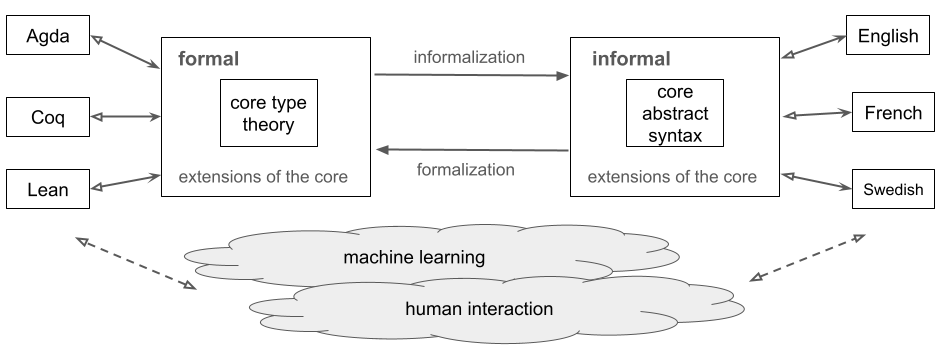

# Informath: Informalization and Autoformalization of Formal Mathematics

(c) Aarne Ranta 2025

## The Informath project

The Informath project addresses the problem of translating between formal and informal languages for mathematics. The original picture is the following:



Informath started in early 2024, but it has a background of a long tradition of translating between formal and informal languages by using GF, Grammatical Framework. New relevance for this task has been created by recent attempts to "teach mathematics" to Artificial Intelligence (AI) systems. These contemporary systems, such as Google's AlphaProof, combine machine learning (e.g. large language models) with formal proof systems, to guarantee the correctness of results. In this context,

- **autoformalization** is automatic translation from informal to formal language
- **informalization** is (automatic) translation from formal to informal language

An insight that has guided GF from the beginning is that informalization is easier than autoformalization, because it goes from a restricted, semantically explicit formal notation to an open-ended, semantically often implicit natural language. Recent developments in AI have suggested something similar: one can "train" language models to formalize by providing them data generated by automatic informalization. Informath can become a useful source of such data. But its primary purpose is to help the users of formal proof systems to create and document their content.


## The languages MathCore, Dedukti, and Informath

This directory contains
- MathCore, a minimal English CNL for mathematics
- Informath, an extension of Core with alternative expressions
- a grammar, parser, and generator for the proof system [Dedukti](https://deducteam.github.io/)
- a translator from MathCore to Dedukti and vice-versa
- partial grammars and generators to Agda and Lean (Lean forthcoming)
- translations between MathCore and Informath (in progress)

[Dedukti](https://deducteam.github.io/) is a minimalistic logical framework aimed as an interlingual between different proof systems such as Agda, Coq, Isabelle, and Lean.
Its purpose is to help share formalizations between these systems.
Dedukti comes with an efficient proof checker and evaluator.
Translations from many other proof system to Dedukti have been built, and this work is ongoing.

Technically, Dedukti is described as an implementation of Lambda-Pi-calculus with rewrite rules.
It is similar to Martin-Löf's logical framework from the 1980's, except for a more liberal syntax of rewrite rules.
Thereby, it is also similar to the ALF system of 1990's and to the abstract syntax of GF, Grammatical Framework.

Due to its simplicity and expressivity, together with an existing implementation and conversions, Dedukti is a promising choice for the "core type theory" in the Informath project, whose original picture is shown above.

In the same way, the MathCore language defined in this directory is meant to be the "core abstract syntax" of Informath.

In the current set-up, the translations go between MathCore and Dedukti, ignoring the extensions shown in the above picture. This seems to be a good way to go. On the type theory side, translations have already been established between other frameworks and Dedukti, and there is no need to extend the interlingual type theory for the purpose of these translations. On the natural language side, the option we first investigated was to keep MathCore and "extensions" as two separate languages, where the extensions are provided by the [ForTheL](http://nevidal.org/download/forthel.pdf)-based [grammar](../forthel/) in "version 2" of this project. However, the long distance between the abstract syntaxes of MathCore and ForTheL soon made us to change our mind and replace ForTheL by a proper extension (in the technical sense of GF) of MathCore, now called Informath.

This gives us an updated picture of the Informath project:


This directory covers the "formal" and "informal" boxes and all the operations marked by arrows.

While being very much inspired by ForTheL, the Informath grammar differs from the original ForTheL in a few ways:

- **Grammaticality**: Informath follows the agreement rules of English (and other languages) instead of allowing free variation of e.g. singular and plural forms; this makes it better usable as the target of informalization.
- **Ambiguity**: ForTheL prevents syntactic ambiguities by means of devices such as brackets. Informath tries to capture all syntactic ambiguities that exist in natural language, and delegates it to the logical framework to resolve them by semantic clues. This is in line with the findings in [*The language of Mathematics*](https://link.springer.com/book/10.1007/978-3-642-37012-0) by Mohan Ganesalingam.
- **LaTeX**: The original ForTheL is plain text, whereas Informath (like some other later versions of ForTheL) allows the full use of LaTeX similar to usual mathematical documents; this is one of the
- **Extensions**: Informath is open for extensions with new forms of expression when encountered in mathematical text. In ForTheL, new concepts can be defined, but the overall syntax is fixed. Because of the design of Informath, every extension should be equipped with a new semantic rule that converts it to MathCore.
- **Omissions**: Informath is not guaranteed to cover all of the original ForTheL. In particular, constructs that differ from grammatical English are usually omitted.
- **Multilinguality**: Informath will have several concrete syntaxes sharing a common abstract syntax, reusing the ForTheL grammars in v2. 

The MathCore language shares some features with Informath: grammaticality, LaTeX support, and extensibility (with a lexicon). But the other features are delegated to Informath via the NLG function.

## The design of MathCore

MathCore is a minimalistic grammar for mathematical English. It is based on the following principles:

- **Completeness**: all Dedukti code can be translated to MathCore.
- **Non-ambiguity**: all MathCore text has a unique parse tree and a unique translation to Dedukti.
- **Losslessness**: Core is a lossless representation of Dedukti; that is, all Dedukti code translated to MathCore can be translated back to the same Dedukti code (module some differences yet to be specified).
- **Traceability**: Dedukti code and MathCore text can be aligned part by part.
- **Grammaticality**: MathCore text is grammatically correct English (with mathematical symbols and some mark-up to prevent ambiguity). 
- **Naturalness**: MathCore supports natural expressions for mathematical concepts using nouns, adjectives, verbs, and other structures conventionally used in mathematical text.
- **Minimality**: MathCore is defined to have exactly one way to express each Dedukti judgement. Alternative ways are provided in Informath via NLG. Typically, the unique way is the most straightforward one. For example, complex mathematical expressions are given in their verbal forms ("the sum of x and y") rather than formulas ("x + y"), because formulas are not available when any of the constituents if not formal ("x + the successor of y").
- **Extensibility**: MathCore can be extended with lexical information assigning English verbalizations to Dedukti identifiers.

The following propertes are, however, *not* expected:

- **Type correctness**: MathCore text can be semantically invalid, leading to syntactically correct Dedukti code that is rejected by Dedukti's type checker.
- **Fluency**: MathCore text can be repetitive and even hard to read; making it better is delegated to ForTheL+ via the NLG component.
- **Compositionality**: The translation between Dedukti and MathCore is not compositional in the strict sense of GF, as the two languages have different abstract syntaxes. For example, Core supports the aggregation of conjuncts and function argument lists, without which it would be even less readable; and the basic type system is richer than in Dedukti, for instance distinguishing between expressions that represent kinds, objects, and propositions.
- **Natural language input**: while the grammar of MathCore is reversible, it is tedious to write MathCore. It is intended to be produced indirectly: by conversion from Dedukti on one hand and Informath on the other.
- **Multilinguality**: MathCore has been implemented by GF RGL and is therefore ready for concrete syntax in other languages than English. 

The rationale of this design is modularity and an optimal use of existing resources:

- Type checking is delegated to Dedukti.
- Conversions to different frameworks are also delegated to Dedukti.
- Variation of natural language input and output is delegated to Informath.

## Implementation

The following programming languages have been used so far in Informath:
- **GF**: [Grammatical Framework](https://www.grammaticalframework.org/) used for implementing MathCore and Informath, maximally using its Resource Grammar Library (RGL).
- **Haskell**: used for writing conversions between formal and informal, via embedded GF grammars in the GADT format (Generalized Algebraic Datatypes) supporting almost compositional functions in NLG.
- **BNFC**: [BNF Converter](https://bnfc.digitalgrammars.com/), used for implementing Dedukti. The implementation includes a parser, a printer, and an abstract syntax in Haskell, all generated from [this BNF grammar](./typetheory/Dedukti.bnf). Also used for the fragments of Agda and Lean addressed in the project.
- **Python**: used for generating GF lexica from term dictionaries, in particular [Wikidata](https://www.wikidata.org/). These lexica are currently available as a part of ForTheL in v2. 

## Usage

It is too early to document the usage of this software, because its user interface has not yet stabilized.
The emerging interface is in the file `Informath.hs`. Its two modes are interactive shell and conversion of files.
```
  $ ./RunInformath (<file.dk> | <file.dkgf> | <textfile>)?
```
The shell has following functionalities:
```
  > <dedukti_jmt>  # convert Dedukti to Informath
  > ?<informath_jmt>  # convert Informath to Dedukti
  > =<dedukti_jmt>  # roundtrup Dedukti to Informath to Dedukti
  > gr  # generate random Informath jmt and convert to Dedukti
```
The file conversion mode depends on the file suffix:
```
<file.dk>: Dedukti file converted to natural language
<file.dkgf>: add user-defined constants to the grammar
<textfile>: parse text file and convert to Dedukti
```
In order for this to work, you need to compile the Dedukti and the Informath grammars:
```
  $ make Informath.pgf
  $ make Dedukti
  $ ln -s typetheory/Dedukti
  $ ln -s informath/Informath.hs
  $ make RunInformath
```
An example of a readily available test case is
```
  $ runghc RunInformath.hs nat.dk
```
**Note**: with some versions of GHC libraries, `make Informath.pgf` results into a `Informath.hs` that gives an error about an undefined monad operation. This is fixed by adding the line `import Control.Monad` to the import list. The current Makefile does this with a sed command - which may cause an error with some other versions of GHC libraries.

## User-defined constants

The lexicon part (files Constants*) is expected to give verbalizations to defined constants in .dk files. This part can be dynamically generated with the commands
```
  $ ./RunInformath <file>.dkgf
  $ make Informath.pgf
  $ make RunInformath
```
which for instance from [nat.dkgf](./nat.dkgf) generates three files:
- [Constants.hs](./Constants.hs)
- [Constants.gf](./Core/Constants.gf)
- [ConstantsEng.gf](./Core/ConstantsEng.gf)

and compiles Informath.pgf with them. The format of .dkgf files is a list of lines of one of the following forms:
```
<ident> <cat> <word>+  # Dk_<ident> = mk<cat> "<word>"+ 
<ident> <cat> = <gf-expr>  # Dk_<ident> = <gf-expr>
<ident> <cat> -> <gf-ident> 
```
The first two forms generate new entries in the two Constants*.gf files, defining functions named `Dk_<ident>` of type `<cat>`and with concrete syntax as shown above. The third form uses a globally defined function from the fine [Notations.gf](./Notations.gf) and its English concrete syntax, without generating new GF rules. Its effect is to map `<ident>` in Dedukti code to `<gf-ident>` in the GF translation of the code.


## Generating Agda

There is now a simple generation of Agda from Dedukti. At the moment, it is only reliable for generating Agda "postulates". The usage is
```
  $ make Agda               # at the first time
  $ ln -s typetheory/Agda
  $ runghc Dedukti2Agda.hs <file>.dk | grep postulate
```
The result from [nat.dk](./nat.dk) typechecks in Agda.

## ToDo

- complete the MathCore-Dedukti conversions (close to complete, but can make better use of the Exp/Kind/Prop distinction)
- complete the MathCore-Informath conversions
- generate Lean code
- add concrete syntaxes to new languages

