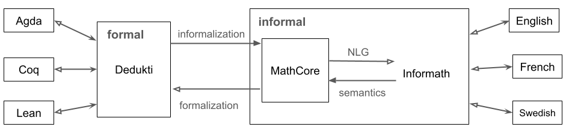

# Informath: Informalization and Autoformalization of Formal Mathematics

(c) Aarne Ranta 2025

## The Informath project

The Informath project addresses the problem of translating between formal and informal languages for mathematics. It aims to translate between multiple formal and informal languages in all directions. The formal languages included are Agda, Coq, Dedukti, and Lean. The informal languages are English, French, and Swedish. More languages will be added later.

Informath started in early 2024, but it has a background of a long tradition of translating between formal and informal languages by using GF, Grammatical Framework. New relevance for this task has been created by recent attempts to "teach mathematics" to Artificial Intelligence (AI) systems. These contemporary systems, such as Google's AlphaProof, combine machine learning (e.g. large language models) with formal proof systems, to guarantee the correctness of results. In this context,

- **autoformalization** is automatic translation from informal to formal language
- **informalization** is (automatic) translation from formal to informal language

An insight that has guided GF from the beginning is that informalization is easier than autoformalization, because it goes from a restricted, semantically explicit formal notation to an open-ended, semantically often implicit natural language. Recent developments in AI have suggested something similar: one can "train" language models to formalize by providing them data generated by automatic informalization. Informath intends to become a useful source of such data. But its primary purpose is to help the users of formal proof systems to create and document their formal code.


## The languages involved

This directory contains
- [MathCore](grammars/MathCore.gf), a minimal CNL for mathematics
- MathCoreEng, Fre, Swe - concrete syntaxes of MathCore in [gramamrs](./grammars/).
- [Informath](grammars/Informath.gf), an extension of MathCore with alternative expressions
- a [grammar](typetheory/Dedukti.bnf) with generated parser and printer for the proof system [Dedukti](https://deducteam.github.io/)
- a translator from MathCore to Dedukti and vice-versa
- partial grammars of [Agda](https://wiki.portal.chalmers.se/agda/pmwiki.php), [Coq](https://coq.inria.fr/), and [Lean](https://lean-lang.org/) in [typetheory](./typetheory/) with generated parsers and printers
- translations between MathCore and Informath

The structure of the project is shown in the following picture:



Here is an example statement involving all of the currently available languages. The Dedukti statement has been used as the source of all the other formats. Both MathCore and Informath could also be used as source, by parsing them and converting to Dedukti.
```
Dedukti: prop110 : (a : Elem Int) -> (c : Elem Int) -> Proof (and (odd a) (odd c)) -> Proof (forall Int (b => even (plus (times a b) (times b c)))).
```


MathCoreEng: Prop110. Let $a$ and $c$ be instances of integers. Assume that we can prove that $a$ is odd and $c$ is odd. Then we can prove that for all integers $b$, the sum of the product of $a$ and $b$ and the product of $b$ and $c$ is even.

InformathEng: Let $a$ and $c$ be integers. Assume that both $a$ and $c$ are odd. Then for all integers $b$, $a b + b c$ is even.

MathCoreFre: Prop110. Soient $a$ et $c$ des instances d'entiers. Supposons que nous pouvons démontrer que $a$ est impair et $c$ est impair. Alors nous pouvons démontrer que pour tous les entiers $b$, la somme du produit de $a$ et de $b$ et du produit de $b$ et de $c$ est paire.

InformathFre: Prop110. Soient $a$ et $c$ des entiers. Supposons qu'et $a$ et $c$ sont impairs. Alors pour tous les entiers $b$, $a b + b c$ est pair.

MathCoreSwe: Prop110. Låt $a$ och $c$ vara instanser av heltal. Anta att vi kan bevisa att $a$ är udda och $c$ är udda. Då kan vi bevisa att för alla heltal $b$, är summan av produkten av $a$ och $b$ och produkten av $b$ och $c$ jämn.

InformathSwe: Prop110. Låt $a$ och $c$ vara heltal. Anta att både $a$ och $c$ är udda. Då för alla heltal $b$, är $a b + b c$ jämnt.

```
Agda: postulate prop110 : (a : Int) -> (c : Int) -> and (odd a) (odd c) -> all Int (\ b -> even (plus (times a b) (times b c)))

Coq: Axiom prop110 : forall a : Int, forall c : Int, (odd a /\ odd c -> forall b : Int, even (a * b + b * c)) .

Lean: axiom prop110 (a c : Int) (x : odd a ∧ odd c) : ∀ b : Int, even (a * b + b * c)
```
MathCore renderings are designed to be unique for each Dedukti judgement. But the full Informath language recognizes several variations. Here are some of them for English, as generated by the system; other languages have equivalents of each of them:

- Prop110. For all integers $a$ and $c$, if $a$ is odd and $c$ is odd, then for all integers $b$, $a b + b c$ is even.
- Prop110. Let $a$ and $c$ be integers. Then if $a$ is odd and $c$ is odd, then for all integers $b$, $a b + b c$ is even.
- Prop110. Let $a , c \in Z$. then if $a$ is odd and $c$ is odd, then for all integers $b$, $a b + b c$ is even.
- Prop110. Let $a$ and $c$ be integers. Assume that $a$ is odd and $c$ is odd. Then for all integers $b$, $a b + b c$ is even.
- Prop110. Let $a , c \in Z$. assume that $a$ is odd and $c$ is odd. Then for all integers $b$, $a b + b c$ is even.
- Prop110. For all integers $a$ and $c$, if both $a$ and $c$ are odd, then for all integers $b$, $a b + b c$ is even.
- Prop110. Let $a$ and $c$ be integers. Then if both $a$ and $c$ are odd, then for all integers $b$, $a b + b c$ is even.
- Prop110. Let $a , c \in Z$. then if both $a$ and $c$ are odd, then for all integers $b$, $a b + b c$ is even.
- Prop110. Let $a$ and $c$ be integers. Assume that both $a$ and $c$ are odd. Then for all integers $b$, $a b + b c$ is even.
- Prop110. Let $a , c \in Z$. assume that both $a$ and $c$ are odd. Then for all integers $b$, $a b + b c$ is even.


### Dedukti

[Dedukti](https://deducteam.github.io/) is a minimalistic logical framework aimed as an interlingual between different proof systems such as Agda, Coq, Isabelle, and Lean.
Its purpose is to help share formalizations between these systems.
Dedukti comes with an efficient proof checker and evaluator.
Translations from many other proof system to Dedukti have been built, and this work is ongoing.

Technically, Dedukti is described as an implementation of Lambda-Pi-calculus with rewrite rules.
It is similar to Martin-Löf's logical framework from the 1980's, except for a more liberal syntax of rewrite rules.
Thereby, it is also similar to the ALF system of 1990's and to the abstract syntax of GF, Grammatical Framework.

Due to its simplicity and expressivity, together with an existing implementation and conversions, Dedukti is a promising choice for the "core type theory" in the Informath project, whose original picture is shown above.

### Agda, Coq, and Lean

Agda, Coq, and Lean are type-theoretical proof systems just like Dedukti. But all of them have a richer syntax than Dedukti, because they are intended to be hand-written by mathematicians and programmers, whereas Dedukti has an austere syntax suitable for automatic generation for code.

Translators from both Agda, Coq, and Lean to Dedukti are available, and we have no plans to write our own ones. However, translators from Dedukti to these formalisms are included in the current directory. They are very partial, because they only have to target fragments of the Agda, Coq, and Lean. This is all we need for the purpose of autoformalization, if the generated code is just to be machine-checked and not to be read by humans.

However, if Informath is to be used as an input tool by Agda, Coq, and Lean users, nice-looking syntax is desirable. In the case of Coq and Lean, we have tried to include some syntactic sugar, such as infix notations. In Agda, this has not yet been done, partly because the syntactic sugar is not as standardized as in Coq and Lean.

### The MathCore language

The MathCore language is meant to be the "core abstract syntax" in Informath. Technically, it is actually a subset of Informath: Informath is implemented as an extension of MathCore.

As shown in the picture above, informalization and autoformalization are in the first place defined between Dedukti and MathCore. On the type theory side, this is composed with translations between other frameworks and Dedukti. On the natural language side, mappings between MathCore and the full Informath are defined on the abstract syntax level of these languages. Input and output of actual natural languages is performed by generation and parsing with concrete syntaxes of each language.

Following Informath Version 2, we first investigated was to keep MathCore and "extensions" as two separate languages, where the extensions are provided by the [ForTheL](http://nevidal.org/download/forthel.pdf)-based [grammar](../v2/forthel/) in this project. However, the long distance between the abstract syntaxes of MathCore and ForTheL soon made us to change our mind and replace ForTheL by a proper extension (in the technical sense of GF) of MathCore, subsequently called Informath.

### The Informath language

While being very much inspired by ForTheL and covering a similar fragment of English, the Informath grammar differs from the original ForTheL in several ways:

- **Grammaticality**: Informath follows the agreement rules of English (and other languages) instead of allowing free variation of e.g. singular and plural forms; this makes it better usable as the target of informalization.
- **Ambiguity**: ForTheL prevents syntactic ambiguities by means of devices such as brackets. Informath tries to capture all syntactic ambiguities that exist in natural language, and delegates it to the logical framework to resolve them by semantic clues. This is in line with the findings in [*The language of Mathematics*](https://link.springer.com/book/10.1007/978-3-642-37012-0) by Mohan Ganesalingam.
- **LaTeX**: The original ForTheL is plain text, whereas Informath (like some other later versions of ForTheL) allows the full use of LaTeX similar to usual mathematical documents; this is one of the
- **Extensions**: Informath is open for extensions with new forms of expression when encountered in mathematical text. In ForTheL, new concepts can be defined, but the overall syntax is fixed. Because of the design of Informath, every extension should be equipped with a new semantic rule that converts it to MathCore.
- **Omissions**: Informath is not guaranteed to cover all of the original ForTheL. In particular, constructs that differ from grammatical English are usually omitted.
- **Multilinguality**: Informath will have several concrete syntaxes sharing a common abstract syntax, reusing the ForTheL grammars in v2. 

The MathCore language shares some features with Informath: grammaticality, LaTeX support, and extensibility (with a lexicon). But the other features are delegated to Informath via the NLG function.

## The design of MathCore

MathCore is a minimalistic grammar for mathematical English, with other languages added via a functor on GF Resource Grammar Library. It is based on the following principles:

- **Completeness**: all Dedukti code can be translated to MathCore.
- **Non-ambiguity**: all MathCore text has a unique parse tree and a unique translation to Dedukti.
- **Losslessness**: Core is a lossless representation of Dedukti; that is, all Dedukti code translated to MathCore can be translated back to the same Dedukti code (modulo some differences yet to be specified).
- **Traceability**: Dedukti code and MathCore text can be aligned part by part.
- **Grammaticality**: MathCore text is grammatically correct natural language (with mathematical symbols and some mark-up to prevent ambiguity). 
- **Naturalness**: MathCore supports natural expressions for mathematical concepts using nouns, adjectives, verbs, and other structures conventionally used in mathematical text.
- **Minimality**: MathCore is defined to have exactly one way to express each Dedukti judgement. Alternative ways are provided in Informath via NLG. Typically, the unique way is the most straightforward one. For example, complex mathematical expressions are given in their verbal forms ("the sum of x and y") rather than formulas ("x + y"), because formulas are not available when any of the constituents if not formal ("x + the successor of y").
- **Extensibility**: MathCore can be extended with lexical information assigning natural language verbalizations to Dedukti identifiers.

The following propertes are, however, *not* expected:

- **Type correctness**: MathCore text can be semantically invalid, leading to syntactically correct Dedukti code that is rejected by Dedukti's type checker.
- **Fluency**: MathCore text can be repetitive and even hard to read; making it better is delegated to ForTheL+ via the NLG component.
- **Compositionality**: The translation between Dedukti and MathCore is not compositional in the strict sense of GF, as the two languages have different abstract syntaxes. For example, Core supports the aggregation of conjuncts and function argument lists, without which it would be even less readable; and the basic type system is richer than in Dedukti, for instance distinguishing between expressions that represent kinds, objects, and propositions.
- **Natural language input**: while the grammar of MathCore is reversible, it is tedious to write MathCore. It is intended to be produced indirectly: by conversion from Dedukti on one hand and Informath on the other.
- **Multilinguality**: MathCore has been implemented by GF RGL and is therefore ready for concrete syntax in other languages than English. French and Swedish are already included.

The rationale of this design is modularity and an optimal use of existing resources:

- Type checking is delegated to Dedukti.
- Conversions to different frameworks are also delegated to Dedukti.
- Variation of natural language input and output is delegated to Informath.

## Prerequisites for use

The following programming languages have been used so far in Informath:

- **GF**: [Grammatical Framework](https://www.grammaticalframework.org/) used for implementing MathCore and Informath, maximally using its Resource Grammar Library (RGL). You need to install both gf-core and gf-rgl.
- **Haskell**: used for writing conversions between formal and informal, via embedded GF grammars in the GADT format (Generalized Algebraic Datatypes) supporting almost compositional functions in NLG.
- **BNFC**: [BNF Converter](https://bnfc.digitalgrammars.com/), used for implementing Dedukti. The implementation includes a parser, a printer, and an abstract syntax in Haskell, all generated from [this BNF grammar](./typetheory/Dedukti.bnf). Also used for the fragments of Agda and Lean addressed in the project.

If you want to check the formal code in any of the proof systems, you must also install them. Informath itself does not require them, but at least Dedukti is useful to have so that you can check the input and output Dedukti code.

- [Dedukti](https://github.com/Deducteam/Dedukti)
- [Agda](https://agda.readthedocs.io/en/latest/getting-started/installation.html)
- [Coq](https://coq.inria.fr/download)
- [Lean](https://leanprover-community.github.io/get_started.html)


## Installation

In order for this to work, you need to compile the formal (Dedukti, Agda, Coq, Lean) and the Informath grammars:
```
$ make 
```
An example of a readily available demo case is
```
$ make demo
```
Consult the [Makefile](./Makefile) to see what these commands exactly do.

**Note**: with some versions of GHC libraries, `make Informath.pgf` results into a `Informath.hs` that gives an error about an undefined monad operation. This is fixed by adding the line `import Control.Monad` to the import list. The current Makefile does this with a `sed` command - which may cause an error with some other versions of GHC libraries. If this happens, you can comment out the `sed` command from the Makefile.

## Usage

It is too early to document the usage of this software, because its user interface has not yet stabilized.
The emerging interface is in the file `Informath.hs`. Its two modes are interactive shell and conversion of files.
```
$ ./RunInformath -v? -variations? \
  (-to-agda|to-coq|to-lean)? \
  -lang=<lang>? \
  (<file.dk> | <file.dkgf> | <textfile>)?
```
The shell has following functionalities:
```
> <dedukti_jmt>     # convert Dedukti to Informath
> ?<informath_jmt>  # convert Informath to Dedukti
> =<dedukti_jmt>    # roundtrup Dedukti to Informath to Dedukti
```
The file conversion mode depends on the file suffix:
```
<file.dk>: Dedukti file converted to natural language
<file.dkgf>: add user-defined constants to the grammar
<textfile>: parse text file and convert to Dedukti
```
In all these cases, the -lang flag selects the natural language to be parsed from or generated (with Eng as default). 
The -v flag generates verbose output with intermediate syntax trees.
The -variations flag generates equivalent natural language outputs. 

In order for this to work, you need to compile the formal (Dedukti, Agda, Coq, Lean) and the Informath grammars:
```
$ make 
```
An example of a readily available demo case is
```
$ make demo
```
Consult the [Makefile](./Makefile) to see what these commands exactly do.

**Note**: with some versions of GHC libraries, `make Informath.pgf` results into a `Informath.hs` that gives an error about an undefined monad operation. This is fixed by adding the line `import Control.Monad` to the import list. The current Makefile does this with a `sed` command - which may cause an error with some other versions of GHC libraries. If this happens, you can comment out the `sed` command from the Makefile.

## User-defined constants

The lexicon part (files Constants*) is expected to give verbalizations to defined constants in .dk files. This part can be dynamically generated with the commands
```
$ ./RunInformath -lang=<Lang>? <file>.dkgf
$ make Informath.pgf
$ make RunInformath
```
which for instance from [nat.dkgf](./nat.dkgf) generates three files:
- [Constants.hs](./Constants.hs)
- [Constants.gf](./Core/Constants.gf)
- [Constants<lang>.gf](./Core/Constants<lang>.gf)

and compiles Informath.pgf with them. The format of .dkgf files is a list of lines of one of the following forms:
```
<ident> <cat> <word>+  # Dk_<ident> = mk<cat> "<word>"+ 
<ident> <cat> = <gf-expr>  # Dk_<ident> = <gf-expr>
<ident> <cat> -> <gf-ident> 
```
The first two forms generate new entries in the two UserConstants*.gf files, defining functions named `Dk_<ident>` of type `<cat>`and with concrete syntax as shown above. The third form uses a globally defined function from the file [BaseConstants.gf](./BaseConstants.gf) and its concrete syntax, without generating new GF rules. Its effect is to map `<ident>` in Dedukti code to `<gf-ident>` in the GF translation of the code.

## Processing in type theory

### Type checking in Dedukti

The type checking is based on the file [BaseConstants.dk](BaseConstants.dk), which is meant to be extended as the project grows. This file type checks in Dedukti with the command
```
  $ dk check BaseConstants.dk
```
The example file [test/exx.dk](test/exx.dk) assumes this file. As shown in `make demo`, it must at the moment be appended to the base file to type check:
```
$ cat BaseConstants.dk test/exx.dk >bexx.dk
$ dk check bexx.dk
```
As this is cumbersome, we will need to implement something more automatic in the future.

## Generating and type checking Agda

There is now a simple generation of Agda from Dedukti. At the moment, it is only reliable for generating Agda "postulates". The usage is
```
$ ./RunInformath -to-agda <file>
```
where the file can be either a .dk or a text file.
As shown by `make demo`, this process can produce valid Agda code:
```
$ ./RunInformath -to-agda test/exx.dk >exx.agda
$ agda --prop exx.agda
```
The base file [BaseConstants.agda](BaseConstants.agda) is imported automatically.

## Generating and type checking Coq

Generation is similar to Coq, but type checking requires at the moment concatenation with [BaseConstants.v](BaseConstants.v):
```
$ ./RunInformath -to-coq test/exx.dk >exx.v
$ cat BaseConstants.v exx.v >bexx.v   
$ coqc bexx.lean
```
This should be made less cumbersome in the future.

## Generating and type checking Lean

Just like in Coq, type checking requires at the moment concatenation with [BaseConstants.lean](BaseConstants.lean):
```
$ ./RunInformath -to-lean test/exx.dk >exx.lean
$ cat BaseConstants.lean exx.lean >bexx.lean   
$ lean bexx.lean
```
This should be made less cumbersome in the future.

## ToDo

- complete the MathCore-Dedukti conversion
- complete the Informath-MathCore conversion
- extend Informath 
- extend the MathCore-Informath conversion
- investigate the possibility of a declarative, user-defined extension of MathCore-Informath conversion
- add concrete syntaxes to yet other natural languages

